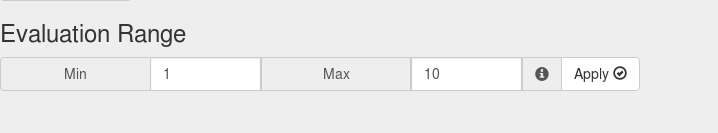

# Cost Benefit Analyser
This is a small tool to create a cost benefit analysis.
* the implementation is quick and dirty. Maybe it will be tidied up in the future
* Features:
  * Define the evaluation range
  * Define the score range
  * Add new measurement parameters
  * Add new competitors
  * Rate competitors for every measurement parameter

* ToDo:
  * Delete measurement parameter
  * Delete competitor

## Usage

### Evaluation Range
* you can define the range of the evaluation values. This is iomportant for the priority of the measurement parameters. There are 2 values: min and max.
  * min: the value you have defined here will be the value for a measurement parameter that has the least priority
  * max: the value you have defined here will be the value for a measurement parameter that has the highest priority
  * you can change the range at any time

### Score Range
* You can define the range of the score. There are 2 values: min and max.
  * min: the value you have defined here will be the value for a competitor that fullfills the parameter least
  * max: the value you have defined here will be the value for a competitor that fullfills the parameter the best
  * you can change the range at any time

### Add new Measurement Parameter
* you can add new measurement parameter by clicking the button:

* A new line will appear in the matrix
* You can now specify the name of the parameter and in the select-box in column "evaluation" you can specify the value for priority of the parameter

* The options in the select box will be the values in the under "evaluation range" defined range

### Add new competitors and score them
* you can add new competitors by clicking the button:

* A new column appears with an input field for the name of the competitor and a select-box for the score:

* Its an expensive software, so the score for measurement parameter "Price" is very low (1)

* You can add a second competitor "Open Source Software". The open source software will fullfill the price parameter very well because its free. So it gets the max score (5)

* But there are more parameters. Lets assume its important that the software has "Feature_1" and "Feature_2". The Expensive Software has both of the features.
The Open Source Software has just one of them (Feature_2) But Feature_1 has a higher priority (9). So the analysis will now look like the following:

### Calculate the Total Score
* When you have finished adding measurement parameters, competitors and scoring its time for the result.
* The most qualified competitor is the one with the highest total score. The Total score can be calculated by clicking the button:

* As you can see the Expensive Software has the higher total score so its the better choice

### Now go smash your piggy bank and buy expensive software! 😃
